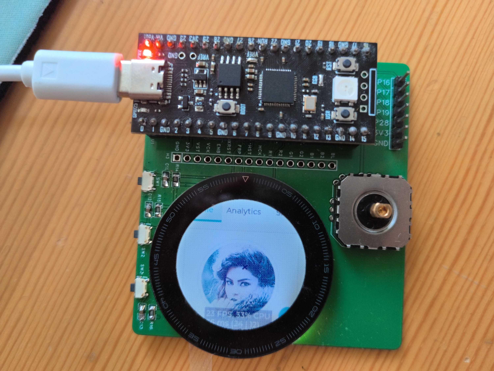

# LPM012M134B 试验场

与 LPM012M134B 显示屏相关的测试电路和代码。目前仅在 RP2040 和 RP2350 平台 arduino-pico 上测试过

[硬件开源](https://oshwhub.com/calico-cat-3333/lpm012m134b_testboard)

## 文件说明

[LPM012M134B_Rev.03_201701006_201808141878_1684852045326_0.pdf](LPM012M134B_Rev.03_201701006_201808141878_1684852045326_0.pdf) LPM012M134B 数据手册

[ProPrj_LPM012M134B_testboard_2025-07-12.epro](ProPrj_LPM012M134B_testboard_2025-07-12.epro) 测试电路板项目文件

[SCH_Schematic1_2025-07-12.pdf](SCH_Schematic1_2025-07-12.pdf) 测试电路板电路原理图

[LPM012M134B_lib](LPM012M134B_lib) 尝试写成 Arduino 库，请复制或软链接到 Arduino/librarys 文件夹中。

[sketch_lpm_lib_basic_test](sketch_lpm_lib_basic_test) Arduino 库基本功能测试代码。

[sketch_LPM_uGUI_test](sketch_LPM_uGUI_test) 接入 uGUI 库的实验

[sketch_lpm_lvgl_test](sketch_lpm_lvgl_test) 接入 LVGL 的实验

[sketch_lpm_adafruitgfx_test](sketch_lpm_adafruitgfx_test) 接入 AdafruitGFX 的实验

[sketch_test_LPM012M134B](sketch_test_LPM012M134B) 最早的测试代码，使用的还是面包板+杜邦线连接电路，仅作记录，不能在测试电路板上运行使用。

## 基本信息

屏幕老王店里的两款圆形 memory lcd 屏，据本人考证分别来自军拓飞腕和军拓铁腕 5

屏幕分辨率为 240 \* 240 使用 RGB222 并行接口。

该屏幕为 memory lcd 64 色，即每个颜色 4 级；透反屏，也就是关闭背光后依然可以靠反射环境光显示，极度省电且可以常显，可惜就是没有触摸屏。

实际上，memory lcd 没有原生灰度且只能按行刷新，这里的四级是依靠将每个像素划分为 ⅔ 大小的大像素 ⅓ 大小的小像素两个子像素实现的，所以可以理解为这是一个 480 行的 8 色屏。所以虽然接口定义上的 R1 R2 容易让人以为是控制一个像素的红色等级的，但实际上是控制一行上两个相邻两个子像素的红色是否开启的，然后一行大像素一行小像素的刷新。

接口定义（实际连接版），参考数据手册第三页：

| 引脚  | 符号  | 描述（翻译） |
| --- | --- | --- |
| 1   | GND | 实际 NC 数据手册推荐接地 |
| 2   | VDD2 | 垂直驱动和像素内存电源，接 4.5V，5V 也行 |
| 3   | NC  | 实际 VOUT 推荐不连接 |
| 4   | VST | 垂直驱动起始信号 |
| 5   | VCK | 垂直驱动时钟信号 |
| 6   | ENB | 像素内存写使能 |
| 7   | XRST | 水平和垂直驱动重置信号 |
| 8   | FRP | 液晶驱动信号（关闭像素）需要 60Hz PWM 波形 |
| 9   | XFRP | 液晶驱动信号（开启像素）与 FRP 信号相反（相位差 180 度） |
| 10  | VDD1 | 水平驱动和像素内存电源，接 3.3V |
| 11  | GND | 接地  |
| 12  | HST | 水平驱动起始信号 |
| 13  | HCK | 水平驱动时钟信号 |
| 14  | R1  | 奇数像素红色信号 |
| 15  | R2  | 偶数像素红色信号 |
| 16  | G1  | 奇数像素绿色信号 |
| 17  | G2  | 偶数像素绿色信号 |
| 18  | B1  | 奇数像素蓝色信号 |
| 19  | B2  | 偶数像素蓝色信号 |
| 20  | NC  | 实际 HOUT 推荐不连接 |
| 21  | VCOM | 通用电极驱动信号，与 FRP 相同 |
| 22  | NC  | 未连接 |
| 23  | LEDA | 背光 LED 正极 |
| 24  | LEDK | 背光 LED 负极 |

所有引脚耐压 6.3V, 信号引脚最大电压等同于 VDD1

实际测试表明如果 VDD1 > VDD2 就会有问题，刷新不了。

垂直时钟信号必须刷满 488 个边沿，否则会有问题，刷新几次之后就会有一帧刷新不出来。

水平时钟信号 122 个边沿。

局部刷新只支持按行刷新，即不需要刷新的区域直接等待 1 us 然后翻转垂直时钟信号。

XRST 是重置信号，根据数据手册，这个信号的使用方法是在刷新开始前拉高，结束后拉低，而不是像一般的重置信号一样常态拉高，重置时低脉冲（实际上如果连续刷新，那么他确实是常态拉高，刷新结束给低脉冲，但是不同的是不刷新的时候是拉低）

FRP VCOM 两个信号完全一样，接到一起就行，XFRP 与前两个信号相反，实现上可以用三极管或 mos 管做一个非门实现，部分平台支持输出反相的 PWM 信号，也可以直接连接 XFRP，但是注意通常有引脚限制（例如 RP2040 必须两个引脚是在同一个 PWM slice 里）

FRP VCOM XFRP 都是 60Hz 但是实际上有点偏差也没问题（我测试 100 Hz 没有问题）

测试板本身使用三极管对 FRP 信号取反得到 XFRP 信号，使用 SGM3110-5.0 将 3.3V 升压到 5V 再通过电阻分压得到 4.5V. 背光控制使用三极管。外接 3 个按钮，一个带按钮的电位器摇杆（型号：普耀FJ08K-S）

参考：

[https://down.cnwans.com/archives/509](https://down.cnwans.com/archives/509) （注意：这个链接中的接线图有错误：VDD1 和 VDD2 的电压写反了，背光的正负极写反了）

[https://github.com/andelf/rp-embassy-playground/blob/master/src/lpm012m134b.rs](https://github.com/andelf/rp-embassy-playground/blob/master/src/lpm012m134b.rs) 

[https://www.bilibili.com/video/BV1KA5QzVEyK/](https://www.bilibili.com/video/BV1KA5QzVEyK/)